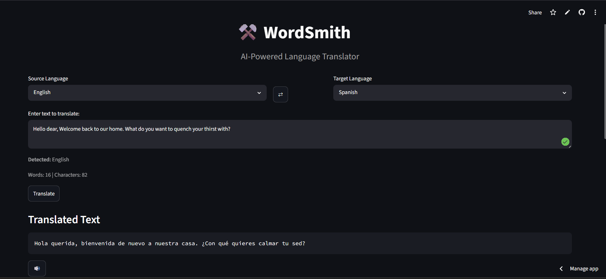
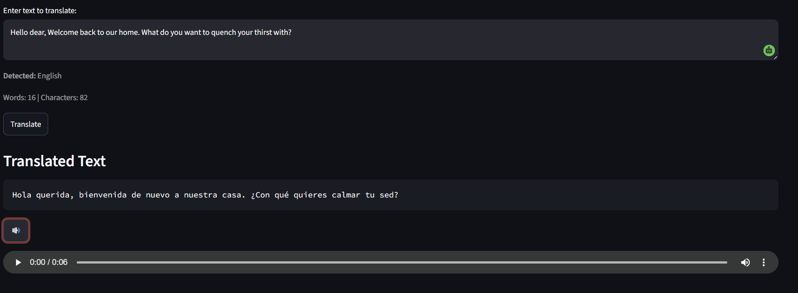

# 🌍 WordSmith

WordSmith is an AI-powered multilingual translation application built using Streamlit, Deep Translator, and gTTS.
It enables users to translate text between multiple languages, detect the input language automatically, listen to translated text using text-to-speech, and seamlessly switch between source and target languages through an intuitive user interface.

## 📸 Screenshots

### Home Screen

### Text-to-Speech Feature

## 🚀 Live Demo

https://wordsmith-ai-translator.streamlit.app/

## 📂 GitHub Repository

https://github.com/anshitaagarg/WordSmith

---

## ✨ Features

* Multilingual Text Translation
* Automatic Language Detection
* Language Swap Functionality 🔄
* Text-to-Speech Output 🔊 
* One-Click Copy Translation
* Word and Character Count
* Translation History Tracking
* Clean and Responsive Streamlit Interface
* Support for Multiple Global Languages

---

## 🛠️ Tech Stack

* Frontend- Streamlit
* NLP & Translation - Deep Translator, LangDetect
* Speech - gTTS (Google Text-to-Speech)
* Data Handling - Pandas
* Version Control & Deployment - Git, GitHub, Streamlit Community Cloud
---

## 📁 Project Structure

WordSmith/

├── app.py

├── translator.py

├── speech.py

├── languages.py

├── history_manager.py

├── requirements.txt

├── .gitignore

├── assets/

└── history/

---

## ⚙️ Installation

Clone the repository:

git clone https://github.com/anshitaagarg/WordSmith.git

Navigate to the project directory:

cd WordSmith

Create a virtual environment:

python -m venv venv

Activate the environment:
Windows:

venv\Scripts\activate

Install dependencies:

pip install -r requirements.txt

Run the application:

streamlit run app.py

---

## 🎯 How to Use

1. Select the source language.
2. Select the target language.
3. Enter text to translate.
4. Click **Translate**.
5. Copy the translated text or listen using the built-in Text-to-Speech feature.
6. Use the swap button to instantly exchange source and target languages.
7. Check the translation history if needed

---

## 🚀 Future Enhancements

* 🎤 Speech-to-Text Translation
* 📱 Mobile-Optimized Interface
* ⭐ Favorite Languages
* 🌙 Dark Mode Support
* 📊 Translation Insights Dashboard
  
---

## 👩‍💻 Author
**Anshita Garg**
Passionate about Artificial Intelligence, Machine Learning, and building practical AI-powered applications.
